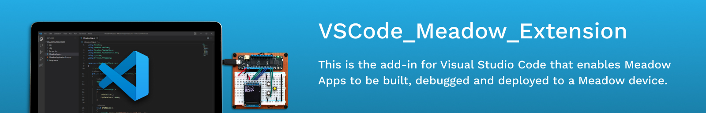
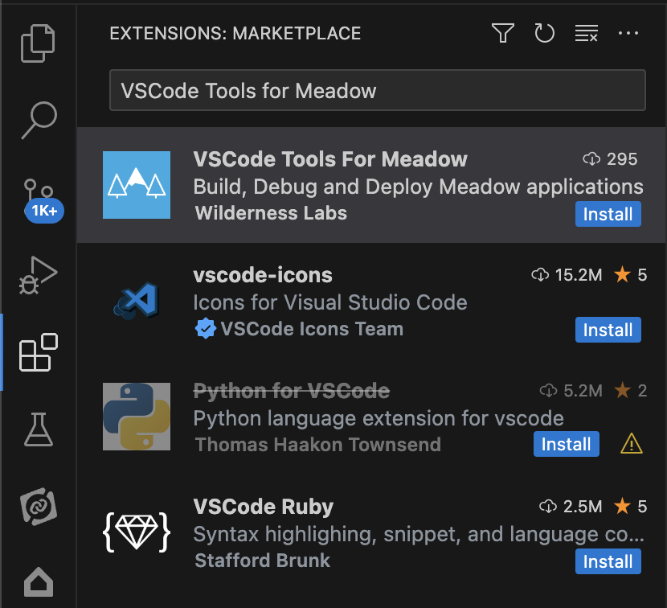
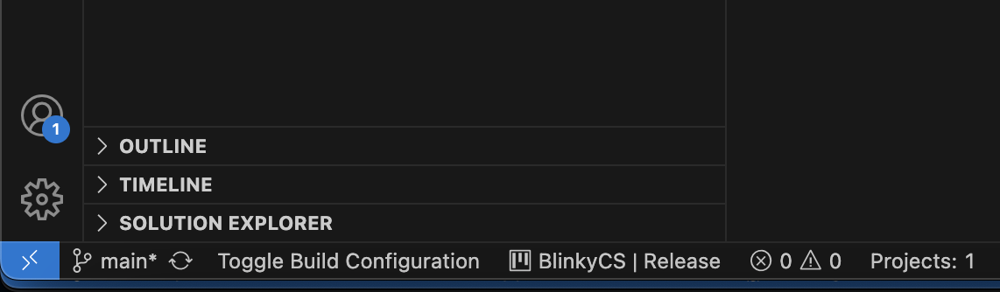
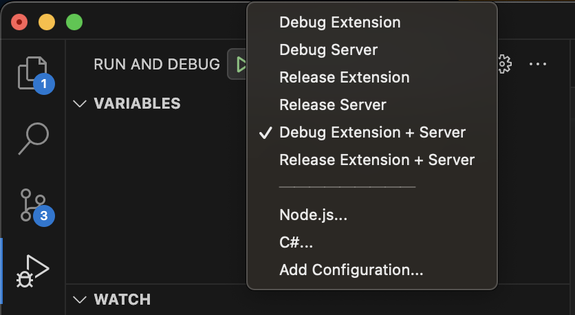

[](https://github.com/WildernessLabs/VSCode_Meadow_Extension/actions)



# VSCode_Meadow_Extension

This is the extension for VSCode that enables Meadow apps to be build, debugged and deployed to a Meadow device.

<p style="text-align:center">

</p>

## Contents
* [Supported Operating Systems](#supported-operating-systems)
* [Using the Extension](#using-the-extension)
  * [Installation](#installation)
    * [Marketplace Installation](#marketplace-installation)
    * [Manual Installation of Alpha/Beta CI builds](#manual-installation-of-alphabeta-ci-builds)
  * [Create a new Meadow Project](#create-a-new-meadow-project)
  * [Building and Deploying your Meadow App in VSCode](#building-and-deploying-your-meadow-app-in-vscode)
  * [.NET Version](#net-version)
  * [Refresh the attached device list](#refresh-the-attached-device-list)
  * [Toggle the Build Configuration](#toggle-the-build-configuration)
* [Building the Extension and Contributing](#building-the-extension-and-contributing)
  * [Prerequisites](#prerequisites)
  * [Initial setup](#initial-setup)
  * [Checkout](#checkout)
  * [Building the Extension](#building-the-extension)
* [Debugging just the TypeScript Extension](#debugging-just-the-typeScript-extension)
  * [Packaging VSIX](#packaging-vsix)
* [License](#license)
* [Support](#support)


## Supported Operating Systems
We tested this extension on the following operating systems:
- Windows
- macOS 
- Linux (Ubuntu)

## Using the Extension

### Installation

#### Marketplace Installation
1. In VSCode goto the _Extensions_ tab (macOS: Cmd+Shift+X. Others: Ctrl+Shift+X)
2. In the search bar type `VSCode Tools for Meadow`. It should be the 1st extension in the list.
3. On the bottom right of the listed item should be an `Install` button. Click it.
4. The extension should now be installed.

It should look similar to this:



#### Manual Installation of Alpha/Beta CI builds
1. Download the alpah/beta extension (.vsix file) from out [latest GitHub CI](https://github.com/WildernessLabs/VSCode_Meadow_Extension/actions).
2. In VSCode goto the _Extensions_ tab (macOS: `Cmd+Shift+X`. Others: `Ctrl+Shift+X`)
3. click the `...` menu and choose _Install from VSIX..._.
3. Pick the file you downloaded to install.

### Create a new Meadow Project

In the terminal:

1. Run `dotnet new install WildernessLabs.Meadow.Template`
2. Create and/or navigate into a directory with the name of your new app (ie: `MeadowApp1`).
3. Run `dotnet new Meadow`

    Alternatively, you can also specify the folder where your new project will go directly by appending the `--output` parameter.
    
    ```console
    dotnet new Meadow --output MyNewMeadowApp
    ```

### Building and Deploying your Meadow App in VSCode

1. Ensure your Meadow board is plugged in, and up to date.
2. Open your new app's folder in VSCode.
3. Any attached devices should appear in the _Run and Debug_ list
4. Choose _Run -> Start Debugging_ (short-cut: `F5`) (Your code will automagically be built first).
5. If you have move than 1 Meadow device attached, you will be prompted to pick a serial port/device to deploy to. If you have only have 1 Meadow device attached it will use that automagically.
6. Watch the output in the _Termainal_  and _Debug Console_ tabs, as your app is deployed!
7. You will be able to set breakpoints and debug your Meadow App.

### .NET Version

You may need to add a `global.json` file to your project's directory to tell it to use .NET 6.0:

```
"sdk": {
		"version": "6.0.413",
		"allowPrerelease": false,
		"rollForward": "latestMinor"
	}
```

### Refresh the attached device list
You can refresh the list of attached device list by using the following short-cut on:
- macOS use: `Cmd+Alt+Shift+R`
- Other platforms use: `Ctrl+Alt+Shift+R`

or search for the select device command by pressing `Ctrl+Shift+P` and typing "Meadow" when prompted

### Toggle the Build Configuration
You can toggle the project's build configuration, using the `Toggle Build Configuraton` button on the bottom status bar, to toggle between Debug and Release builds: 



You can also use the following short-cut on:
- macOS use: `Cmd+Alt+Shift+T`
- Other platforms use: `Ctrl+Alt+Shift+T`

## Building the Extension and Contributing

### Prerequisites
- Install NPM

Then run the following commands on the command line, once NPM is installed
- `npm i -g @vscode/vsce`
- `npm i -g @vscode/debugprotocol`
- `npm install -g webpack`
- `npm install -D ts-loader`
- `npm i typescript --save-dev`
- .NET ([Mono on macOS](https://www.mono-project.com/download/stable/#download-mac), [.NET 6.x on Windows/Linux](https://dotnet.microsoft.com/en-us/download/dotnet/6.0))

### Initial setup

With all the listed preqrequisites installed, run `npm i` to ensure all of the packages are installed and up to date for the project.

### Checkout

- Be sure to checkout this repo with submodules: `git clone --recurse-submodules git@github.com:WildernessLabs/VSCode_Meadow_Extension.git`
- [Meadow.CLI](https://github.com/WildernessLabs/Meadow.CLI) repo must be cloned adjacent to this checkout.

### Building the Extension

The extension has 2 parts. There is a client, which is written in _TypeScript_ and a server which is writtne in _C#_.

- Open the extension folder VSCode.
- Got to _Run and Debug_ (macOS: `Cmd+Shift+D`. Others: `Ctrl+Shift+D`)



You can choose the `Debug Extension + Server` option in the debug menu in VSCode to debug both parts at the same time.

This will launch the server process in debug listening mode.

You will be able to set breakpoints in the host instance of VSCode and debug the TypeScript extension.

This does not allow you to debug the arbitrary commands sent to the vscode-meadow.exe process from the extension for things like getting a list of devices.  This will only allow you to debug the code path of a VSCode instance starting a Deploy/Debug session.

## Debugging just the TypeScript Extension

- Choose `Debug Extension` from the Debug menu in VSCode and run it.
- Open a meadow project in the new instance of VSCode which now includes the extension.

You can set breakpoints in the host instance of VSCode and debug the TypeScript.

### Packaging VSIX

To produce a VSIX for the VSCode extension:
- Open a Terminal Window in the extension folder
- Run the following command (we recommend building with `--pre-release` flag when buiding locally, to avoid confusion when installed into VSCode)
    ```console
    vsce package --pre-release
    ```

## License
Copyright 2023, Wilderness Labs Inc.

Licensed under the Apache License, Version 2.0 (the "License");
you may not use this file except in compliance with the License.
You may obtain a copy of the License at

  http://www.apache.org/licenses/LICENSE-2.0

Unless required by applicable law or agreed to in writing, software
distributed under the License is distributed on an "AS IS" BASIS,
WITHOUT WARRANTIES OR CONDITIONS OF ANY KIND, either express or implied.
See the License for the specific language governing permissions and
limitations under the License.

## Support

Having trouble building/running these projects? 
* File an [issue](https://github.com/WildernessLabs/Meadow.Desktop.Samples/issues) with a repro case to investigate, and/or
* Join our [public Slack](http://slackinvite.wildernesslabs.co/), where we have an awesome community helping, sharing and building amazing things using Meadow.
