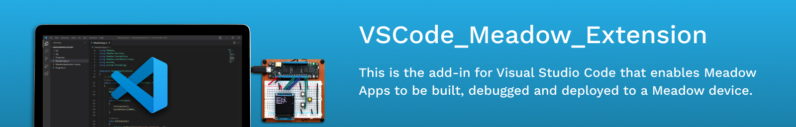
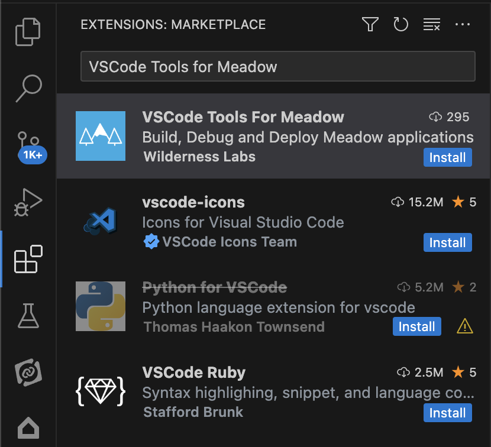
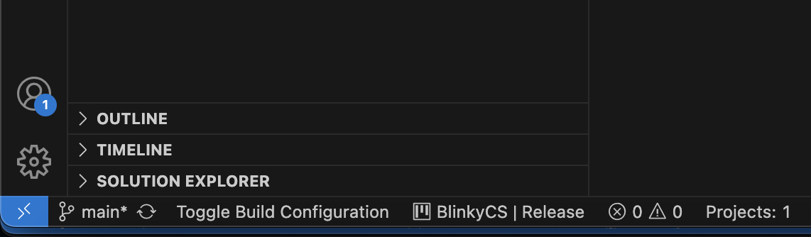

[](https://github.com/WildernessLabs/VSCode_Meadow_Extension/actions)



# VSCode_Meadow_Extension

This extension enables you to build, debug, and deploy Meadow applications directly from VSCode. It integrates with VSCode's debug UI and command palette to provide a streamlined workflow for Meadow development.


## Architecture

### Debug Adapter Protocol (DAP)

The VSCode extension uses the Debug Adapter Protocol to handle all debugging operations. This is the same protocol used by VS2022 and Rider, which means the core debugging logic is shared across all three IDEs. When you press F5 to start debugging, here's what happens behind the scenes:

1. The extension launches the DAP adapter process (vscode-meadow.exe)
2. The adapter handles all communication with your Meadow device
3. Debug events flow back to VSCode's debug UI through the adapter
4. When you stop debugging, the adapter cleanly closes the connection and resumes your device

This architecture has a major benefit: we maintain a single codebase for debugging that works consistently across VSCode, Visual Studio, and Rider. Bugs get fixed once and benefit all three IDEs.

### Why DAP Matters

Before DAP, each IDE had its own debugging implementation. That meant debugging a breakpoint might work differently depending on which IDE you used. Now, whether you're in VSCode, VS2022, or Rider, the debugging experience is the same. The extension focuses on the VSCode-specific integration (UI, commands, settings), while the actual debugging is handled by shared code in the Meadow.Debugging repository.

## Release Notes

### 3.0.0

- Unified IDEs to all use centralised DAP for debugging.
- Debug sessions now properly clean up when stopped, allowing immediate redeployment without device reset.

### 2.2.0

- Stability changes for OS 2.2 and above.

### 2.0.1

- Update logging to provide more information and be more like Visual Studio.

### 2.0.0

- Update to get debugging working with Meadow.CLI 2.x.

### 1.9.7

- Change to pick up the fact ProjLab is now part of NoLink in Meadow.CLI.

### 1.9.6

- Add extra check to re-enable the runtime if it isn't enabled after deployment.

### 1.9.4

- Fix for VSCode on Windows so that debugging works again.

## Contents
* [Supported Operating Systems](#supported-operating-systems)
* [Using the Extension](#using-the-extension)
  * [Installation](#installation)
    * [Marketplace Installation](#marketplace-installation)
    * [Manual Installation of Alpha/Beta CI builds](#manual-installation-of-alphabeta-ci-builds)
  * [Create a new Meadow Project](#create-a-new-meadow-project)
  * [Building and Deploying your Meadow App in VSCode](#building-and-deploying-your-meadow-app-in-vscode)
  * [.NET Version](#net-version)
  * [Refresh the attached device list](#refresh-the-attached-device-list)
  * [Toggle the Build Configuration](#toggle-the-build-configuration)
* [Building the Extension and Contributing](#building-the-extension-and-contributing)
  * [Prerequisites](#prerequisites)
  * [Initial setup](#initial-setup)
  * [Checkout](#checkout)
  * [Building the Extension](#building-the-extension)
* [Debugging just the TypeScript Extension](#debugging-just-the-typeScript-extension)
  * [Packaging VSIX](#packaging-vsix)
* [License](#license)
* [Support](#support)


## Supported Operating Systems
We tested this extension on the following operating systems:
- Windows
- macOS 
- Linux (Ubuntu)

## Using the Extension

### Installation

#### Marketplace Installation
1. In VSCode go to the _Extensions_ tab (macOS: Cmd+Shift+X. Others: Ctrl+Shift+X)
2. In the search bar type `VSCode Tools for Meadow`. It should be the 1st extension in the list.
3. Click it the `Install` button on the bottom right of the listed item.
4. The extension should now be installed.

It should look similar to this:



#### Manual Installation of Alpha/Beta CI builds
1. Download the alpha/beta extension (.vsix file) from our [latest GitHub CI](https://github.com/WildernessLabs/VSCode_Meadow_Extension/actions).
2. In VSCode go to the _Extensions_ tab (macOS: `Cmd+Shift+X`. Others: `Ctrl+Shift+X`)
3. click the `...` menu and choose _Install from VSIX..._.
3. Pick the file you downloaded to install.

### Create a new Meadow Project

In a terminal:

1. Run `dotnet new install WildernessLabs.Meadow.Template`
2. Create and/or navigate into a directory with the name of your new app (ie: `MeadowApp1`).
3. Run `dotnet new Meadow`

    Alternatively, you can also specify the folder where your new project will go directly by appending the `--output` parameter.
    
    ```console
    dotnet new Meadow --output MyNewMeadowApp
    ```

### Building and Deploying your Meadow App in VSCode

1. Ensure your Meadow board is plugged in, and up to date.
2. Open your new app's folder in VSCode.
3. Any attached devices should appear in the _Run and Debug_ list
4. Choose _Run -> Start Debugging_ (short-cut: `F5`) (Your code will automagically be built first).
5. If you have move than 1 Meadow device attached, you will be prompted to pick a serial port/device to deploy to. If you have only have 1 Meadow device attached it will use that automagically.
6. Watch the output in the _Terminal_ and _Debug Console_ tabs, as your app is deployed!
7. You will be able to set breakpoints and debug your Meadow App.

### .NET Version

You may need to add a `global.json` file to your project's directory to tell it to use .NET 6.0:

```
"sdk": {
		"version": "6.0.413",
		"allowPrerelease": false,
		"rollForward": "latestMinor"
	}
```

### Refresh the attached device list

You can refresh the list of attached devices by using the following short-cut on:
- macOS use: `Cmd+Alt+Shift+R`
- Other platforms use: `Ctrl+Alt+Shift+R`

or search for the Refresh Device List command by pressing `Ctrl+Shift+P` and typing "Meadow" when prompted

### Toggle the Build Configuration

You can toggle the project's build configuration, using the `Toggle Build Configuraton` button on the bottom status bar, to toggle between Debug and Release builds: 



You can also use the following short-cut on:
- macOS use: `Cmd+Alt+Shift+T`
- Other platforms use: `Ctrl+Alt+Shift+T`

## Building the Extension and Contributing

### Prerequisites

- Install Python
- Install NPM

Then run the following commands on the command line, once NPM is installed:
- `npm i -g @vscode/vsce`
- `npm i -g @vscode/debugprotocol`
- `npm install -g webpack`
- `npm install -D ts-loader`
- `npm i typescript --save-dev`
- .NET (Mono on macOS, .NET 6.x on Windows/Linux)

### Initial setup

With all the listed prerequisites installed, run `npm i` to ensure all of the packages are installed and up to date for the project.

### Checkout

- Be sure to checkout this repo with submodules: `git clone --recurse-submodules git@github.com:WildernessLabs/VSCode_Meadow_Extension.git`
- The Meadow.CLI repo must be cloned adjacent to this checkout.
- The Meadow.Debugging repo contains the DAP adapter code and must be available for the extension to reference the debug protocol implementation.

### Building the Extension

The extension has two parts: a client written in TypeScript and a server written in C#.

The TypeScript client handles the VSCode UI integration. It manages the device list, build configuration toggles, and communicating with VSCode's debug UI. When you start a debug session, the client prepares the launch configuration and passes it to VSCode's debug system.

The C# server is the DAP adapter (vscode-meadow.exe). This is compiled from the Meadow.Debugging repository and included in the extension package. The adapter handles all the actual debugging work: device deployment, connection management, and protocol communication. The TypeScript client doesn't need to know about these details. It just needs to launch the adapter and let VSCode's debug protocol handler manage the conversation.

To build and debug:

- Open the extension folder in VSCode.
- Go to Run and Debug (macOS: Cmd+Shift+D. Others: Ctrl+Shift+D)
- Choose Debug Extension + Server to debug both the TypeScript UI and the C# adapter at the same time.

This approach lets you debug the VSCode integration while the adapter handles the device communication in the background.

## Debugging just the TypeScript Extension

- Choose `Debug Extension` from the Debug menu in VSCode and run it.
- Open a meadow project in the new instance of VSCode which now includes the extension.

You can set breakpoints in the host instance of VSCode and debug the TypeScript.

### Packaging VSIX

To produce a VSIX for the VSCode extension:
- Open a Terminal Window in the extension folder
- Run the following command (we recommend building with `--pre-release` flag when buiding locally, to avoid confusion when installed into VSCode)
    ```console
    vsce package --pre-release
    ```

## License
Copyright 2023, Wilderness Labs Inc.

Licensed under the Apache License, Version 2.0 (the "License");
you may not use this file except in compliance with the License.
You may obtain a copy of the License at

  http://www.apache.org/licenses/LICENSE-2.0

Unless required by applicable law or agreed to in writing, software
distributed under the License is distributed on an "AS IS" BASIS,
WITHOUT WARRANTIES OR CONDITIONS OF ANY KIND, either express or implied.
See the License for the specific language governing permissions and
limitations under the License.

## Support

Having trouble building/running these projects? 
* File an [issue](https://github.com/WildernessLabs/Meadow.Desktop.Samples/issues) with a repro case to investigate, and/or
* Join our [public Slack](http://slackinvite.wildernesslabs.co/), where we have an awesome community helping, sharing and building amazing things using Meadow.
